# Full Stack Application on Google Kubernetes Engine (GKE)

This repository contains the code for a full-stack application deployed on Google Kubernetes Engine (GKE). The application consists of the following services:

## Blogs App - GKE Microservices Demo
Made with ❤️ by Sounish Nath using Angular, Golang, Postgresql, Google Kubernetes Engine 🚀. in begineer friendly way.

- **go-auth-service:** A Go service responsible for user authentication and authorization.
- **go-blogs-service:** A Go service responsible for managing blog posts.
- **angular-blog-client:** A Angular application that serves as the front-end client for the blog service.

# Start the microservices (locally)

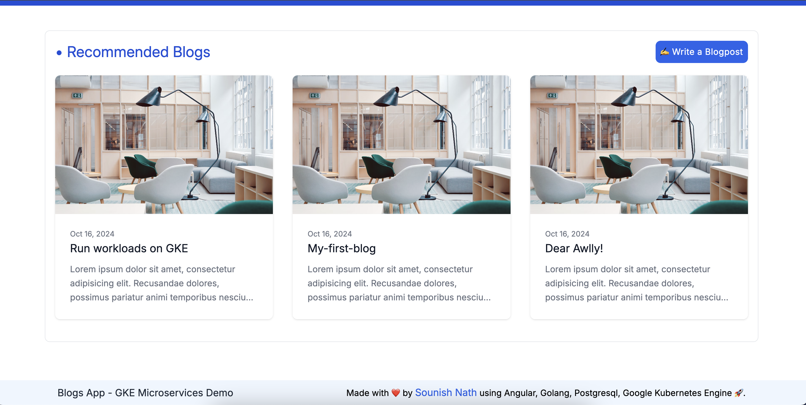

### Build the Docker images 

* Run Postgres db inside Docker (I don't have it natively)
```
sh +x scripts/postgres.sh
```

* Build Auth Service Microservice container
```
cd go-auth-service
make docker-build-push
```

* Build Blogs Service Microservice container
```
cd go-blogs-service
make docker-build-push
```

* Build Blogs Frontend Appservice container
```
cd angular-frontend
make docker-build-push
```
**Images which I built: (just your reference)**

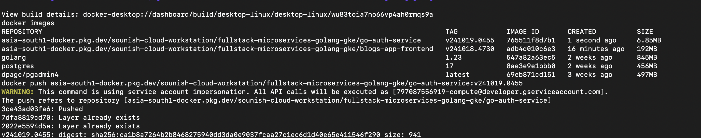

### Docker compose infrastructure:

Following script is present inside `scripts/postgres.sh` file. Which i built in terms of running the Postgresql in my machine. Later evolved to run the complete infrastructure. 

**PS: Felt lazy to recreate in a new Docker-compose yaml.**

```bash
#!/bin/bash

# check the available version
docker --version
# check prune necessary setups
docker system prune
# create a docker volume
docker volume create --name=postgres-data

# run the postgres compose container
docker-compose -f postgres.docker-compose.yaml down
docker-compose -f postgres.docker-compose.yaml up --build
```

Sample docker runs
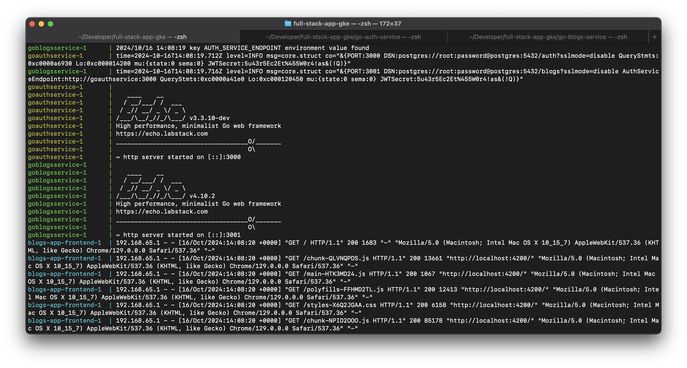

> Note: The Docker images that i built, I kept in my private aartifacts registry. (Google-artifact-registry). In case you want to test it out locally use Dockerhub / local.docker repository. 

## Cloud SQL (Postgres) Instance

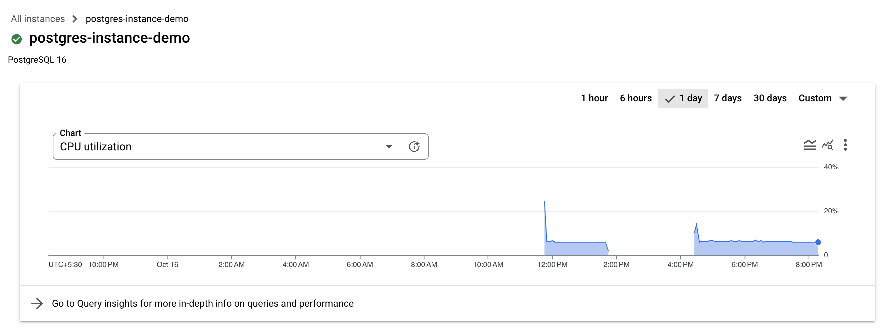

### Try setup the proxy and `KSA -> GSA` Annotation into your postgres instance

Which will help your GKE services to communicate with `postgres-cloudsql-instance`

```bash
gcloud sql instances describe postgres-instance-demo

# Create Kubenetes secrets for cloud sql in GKE
kubectl create secret generic postgres-cloudsql-secret \
  --from-literal=username=root \
  --from-literal=password=some-good-password \
  --from-literal=authdb=auth \
  --from-literal=blogsdb=blogs \
  -n "fullstack-microservice-golang"

# Create a Kube SA account to connect to Cloud SQL via auth proxy
kubectl apply -f service-account.yaml

# -- to connect cloud sql from GKE
gcloud iam service-accounts add-iam-policy-binding \
--role="roles/iam.workloadIdentityUser" \
--member="serviceAccount:sounish-cloud-workstation.svc.id.goog[some-good-k8s-namespace/somegood-service-account]" \
some-good-service-account@sounish-cloud-workstation.iam.gserviceaccount.com

# Turn your service account key into a k8s Secret:
kubectl create secret generic cloudsql-connect-ksa-gsa \
--from-file=service_account.json=~/key.json

# Mount the secret as a volume under the spec: for your k8s object:
volumes:
- name: cloudsql-connect-ksa-gsa-vol
  secret:
    secretName: cloudsql-connect-ksa-gsa
```

> Note: here, I am using `auth-proxy-service`, you can now use the `workload-identity` support for GKE.

**Refer Documentation from Google**: https://cloud.google.com/sql/docs/postgres/connect-kubernetes-engine#service-account-key


## Kubernetes Deployments Infrastructure

All kubenetes manifests you can find in `k8s-infrastructure/*.yaml` directory.

- **namespace.yaml** - To have an isolated environment only for this microservices projects
- **cloudsql-auth-proxy.yaml** : CloudSQL (`Postgres`) is the backend database I am using. To access cloudsql from the GKE k8s-cluster, `AUTHPROXY / Workloads identity` must be created for security.
- **auth-service.yaml** : Contains the authentication microservice arch container
- **blogs-service.yaml**: Contains the blogs microservice arch container
- **Blogs-app-frontend.yaml** : Externally exposed frontend app service on Ngnix webserver.

* Google K8s Autopilot cluster:
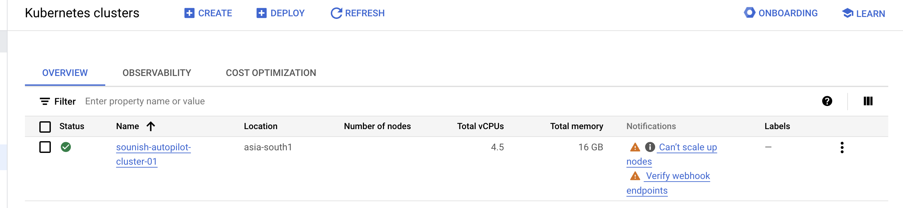

* **To create Autopilot Cluster:**

```bash
#!/bin/bash

gcloud beta container --project "<YOUR_GCP_PROJECT_ID>" clusters create-auto "sounish-autopilot-cluster-01" --region "asia-south1" --release-channel "regular" --network "projects/<YOUR_GCP_PROJECT_ID>/global/networks/default" --subnetwork "projects/<YOUR_GCP_PROJECT_ID>/regions/asia-south1/subnetworks/default" --cluster-ipv4-cidr "/17" --binauthz-evaluation-mode=DISABLED
```

### Bonus: If you are new to K8s then Try this Quick Hack

If you kind the manifests YAML hard to understand. You can learn the `kubectl` command line, to which you can generate your desireed boiler plates (**QUICK HACK**).

* Checkout `scripts/kubernetes_service_deployments.sh` file 

```bash
#!/bin/bash

## based on the postgres.docker.compose.yaml file
# it has the kubernetes deployment manifests generation command line

# -- Auth-service deployment
kubectl create deployment auth-service --image=asia-south1-docker.pkg.dev/sounish-cloud-workstation/fullstack-microservices-golang-gke/go-auth-service:v241000.3127 --port=3000 --replicas=2 --output=yaml --show-managed-fields=true --namespace=fullstack-microservice-golang --dry-run=client

# -- Create a ClusterIP service for auth service 
kubectl create service clusterip auth-service --tcp=3000 --output=yaml --namespace=fullstack-microservice-golang --dry-run=client

# -- Blogs-service deployment
kubectl create deployment blog-service --image=asia-south1-docker.pkg.dev/sounish-cloud-workstation/fullstack-microservices-golang-gke/go-blogs-service:v241015.4818 --port=3001 --replicas=2 --output=yaml --show-managed-fields=true --namespace=fullstack-microservice-golang --dry-run=client

# -- Create a ClusterIP service for blog service 
kubectl create service clusterip blog-service --tcp=3001 --output=yaml --namespace=fullstack-microservice-golang --dry-run=client

# -- Blogs Frontend App deployment
kubectl create deployment blogs-app-frontend --image=asia-south1-docker.pkg.dev/sounish-cloud-workstation/fullstack-microservices-golang-gke/blogs-app-frontend:v241000.5219 --port=80 --replicas=2 --output=yaml --namespace=fullstack-microservice-golang --dry-run=client

# Blogs Frontend App Service
kubectl create service loadbalancer blogs-app-frontend --tcp=4200:80 --output=yaml --namespace=fullstack-microservice-golang --dry-run=client 
```

* K8s deployed workloads:
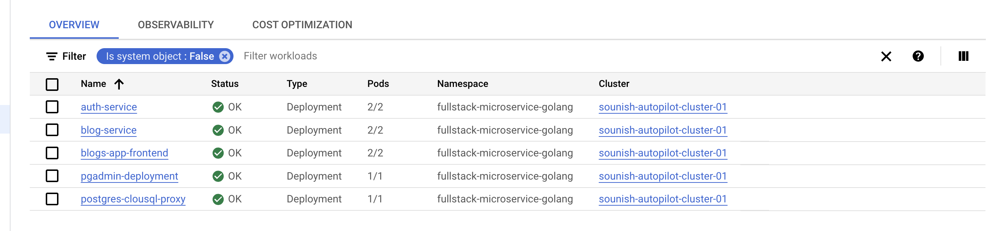

### Sample Authservice - Workloads 

* Auth service observbility Dashboard
* 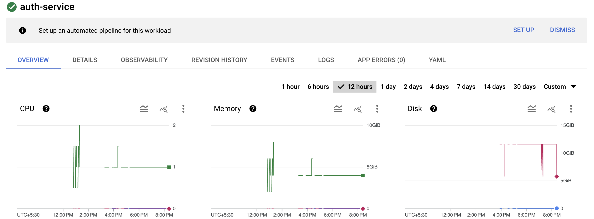
* Auth service Service Avaibility
* 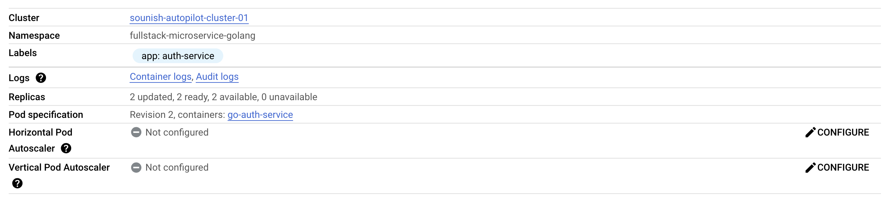
* Auth service Pods network
* 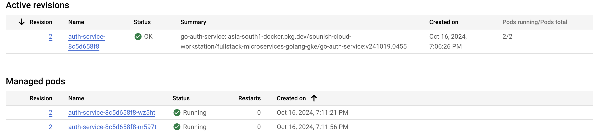
* K8s Services and Ingress
* 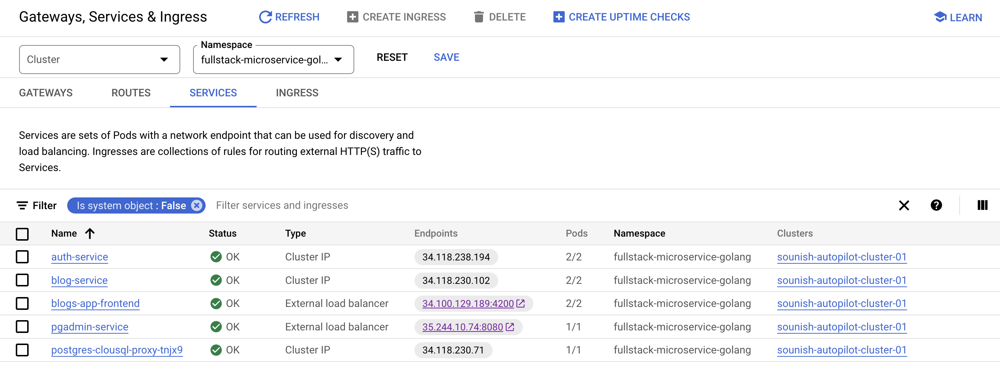

### Sample blog content
```
With great power, comes great responsibility.
This blog talks about the scenarios.
Sounish being now GKE (google kubernetes engine).
Google cloud platform - Google
Thank you for your time.
```

## Blogs App - GKE Microservices Demo

### Login / Signup
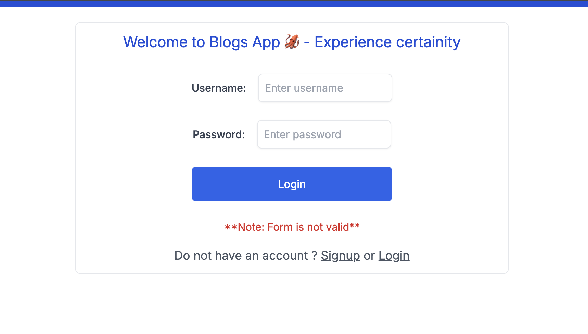
### Recommended Blogs - Home

### Recommended Blogs - Home
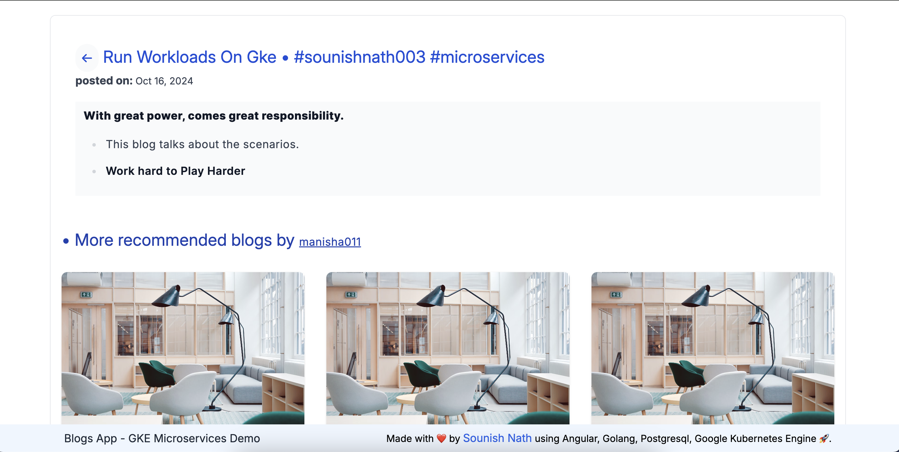
### Create new Blogpost
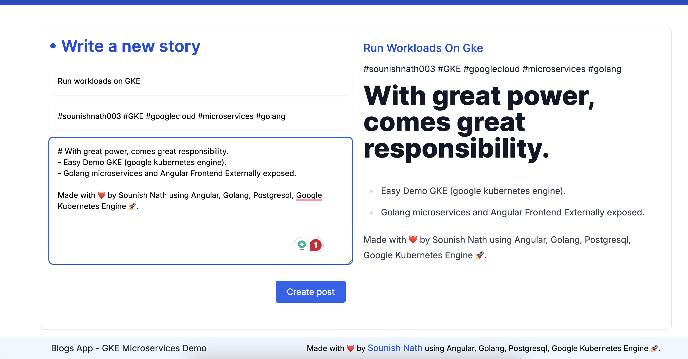


## Kindly Appreciate If you Loved it

Made with ❤️ by Sounish Nath using Angular, Golang, Postgresql, Google Kubernetes Engine 🚀.